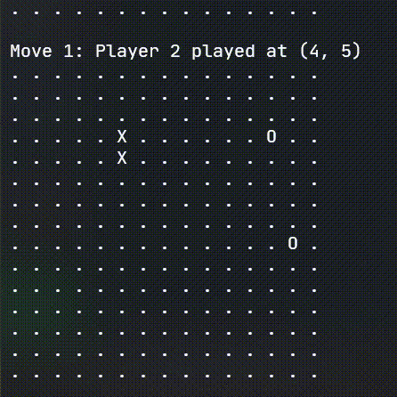
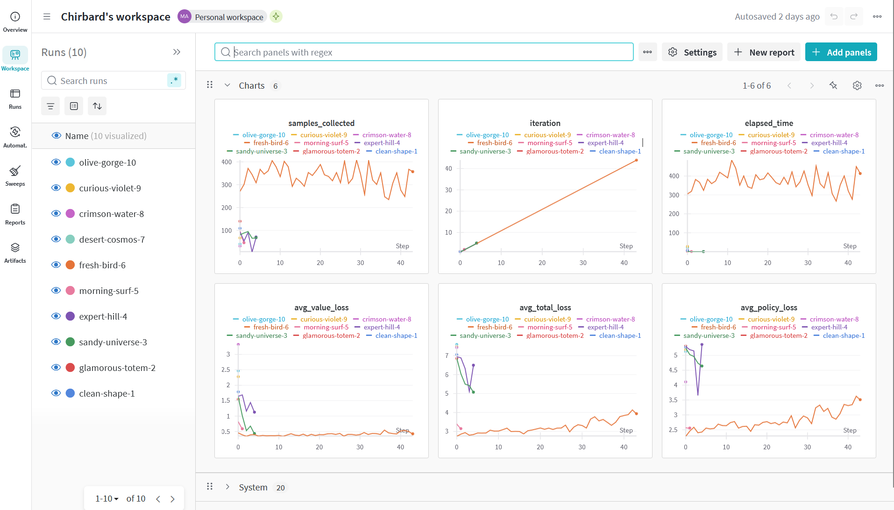

# Gomoku AI

Reinforcement Learning agent that plays Gomoku. Model uses AlphaZero style architecture with a deep neural network and Monte Carlo Tree Search.

## Video of self play

## Features

### Easily adapable to any size board

Just change the values inside `constants.py` file.

### Weights and Biases Integration

Overview on training on Weights and Biases.

### model on hugging face

https://huggingface.co/chirbard/gomoku-ai/tree/main

## Usage

### Training

`main-train.py` file
Change the constants in the begining to change training parameters.

### Playing

`main-play.py` file

## References

1. https://towardsdatascience.com/reinforcement-learning-implement-tictactoe-189582bea542/
2. https://nikcheerla.github.io/deeplearningschool/2018/01/01/AlphaZero-Explained/
